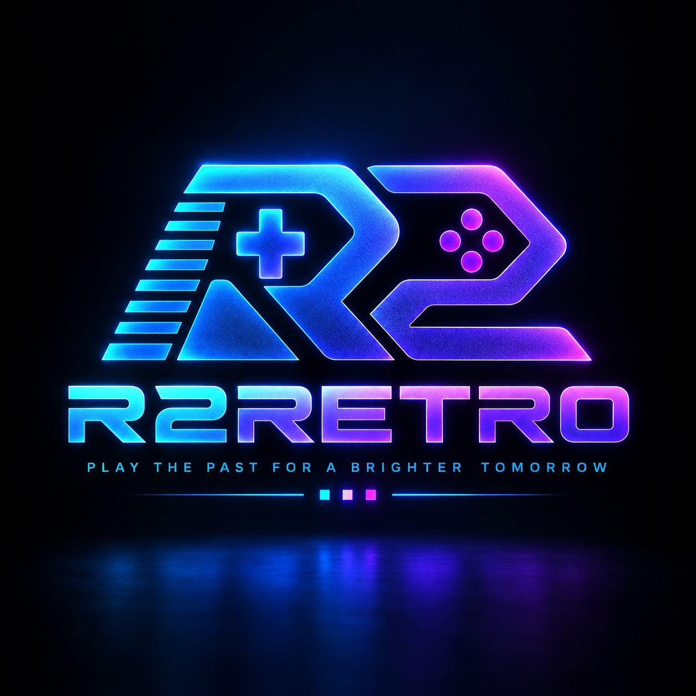
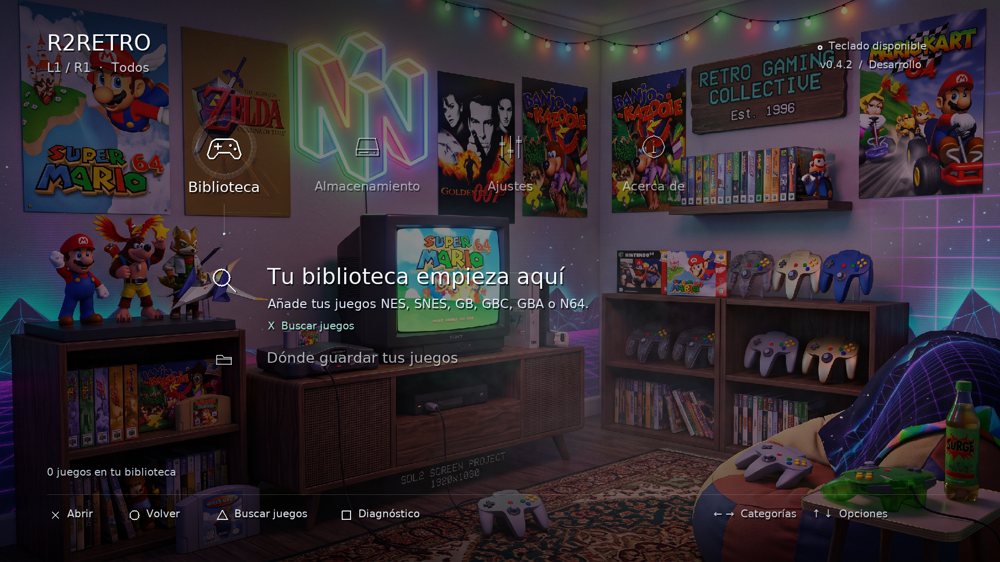
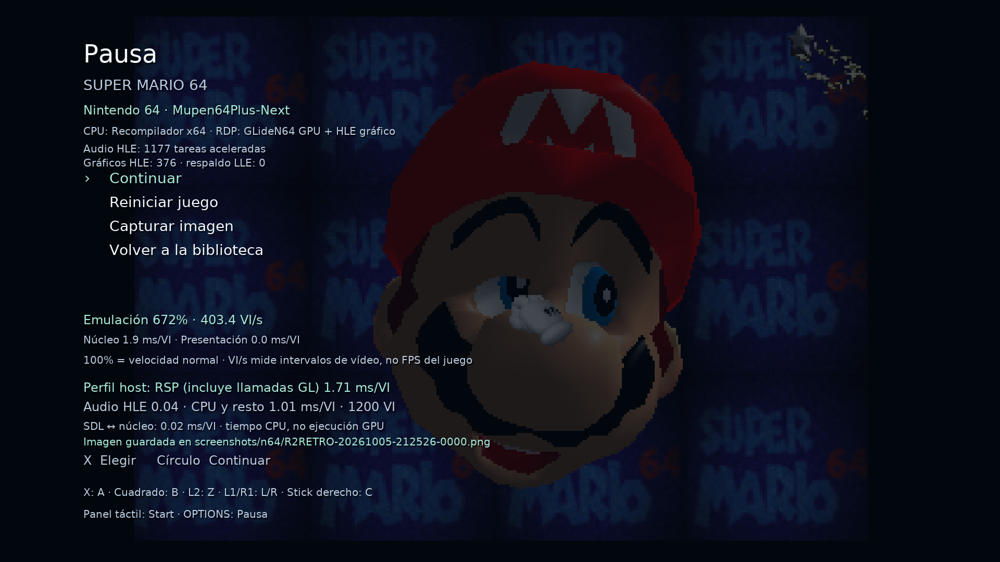
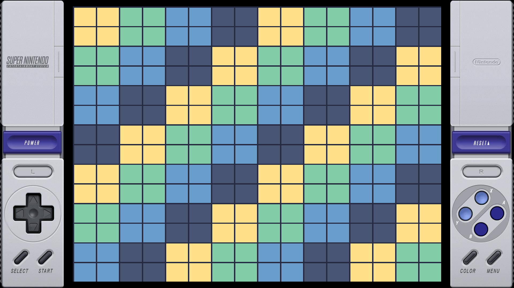

<p align="center"></p>

<h1 align="center">R2RETRO · Retro gaming en tu PS4</h1>
<p align="center">Seis sistemas clásicos. Una biblioteca. Una interfaz inspirada en XMB.</p>

<p align="center">
  
  
  
  
</p>

<p align="center">
  <a href="https://github.com/R2two/R2RETRO/releases/tag/v0.5.7"><b>Descargar PKG</b></a> ·
  <a href="docs/USER-GUIDE.md">Guía de uso</a> ·
  <a href="docs/ROADMAP.md">Próximos pasos</a> ·
  <a href="https://github.com/R2two/R2RETRO/issues">Reportar un problema</a>
</p>

**R2RETRO** es una aplicación homebrew nativa para PlayStation 4 desarrollada por [R2two](https://github.com/R2two). Reúne Nintendo 64, Game Boy, Game Boy Color, Game Boy Advance, NES y SNES con navegación por mando, guardados, capturas y una biblioteca con fichas y carátulas descargables.

> **En desarrollo activo.** La versión publicada es experimental. Compilación y pruebas locales están documentadas; no se garantiza velocidad completa ni compatibilidad universal en PS4. El seguimiento de v0.5.1 informa rendimiento similar en consola, todavía sin un perfil físico detallado. No se incluyen juegos comerciales ni BIOS externas.

## Menú



*Biblioteca y navegación XMB: captura real del frontend desktop v0.4.2. La descarga actual es v0.5.7.*

| Nintendo 64 · GPU + HLE | SNES · marco opcional |
|---|---|
|  |  |
| Contadores, captura y perfil de v0.5.1. **Las cifras son de Linux/Mesa, no de PS4.** | Marco sobre un patrón de prueba original en v0.4.2. |

[Origen y contexto de las imágenes](docs/media/README.md).

## Sistemas integrados

“Integrado” significa disponible en el código y el paquete; no certifica todos los juegos ni velocidad normal en consola.

| Sistema | Núcleo | Archivos | Situación actual |
|---|---|---|---|
| Nintendo 64 | Mupen64Plus-Next | `.z64` · `.v64` · `.n64` | Perfiles automáticos experimentales para Mario USA/Zelda USA1.2; GLideN64 GPU/HLE y Angrylion disponibles. Rendimiento PS4 en investigación. |
| Game Boy | SameBoy | `.gb` | Paletas, marco, guardados, estados y avance rápido integrados. |
| Game Boy Color | SameBoy | `.gbc` | Colores nativos, marco, guardados, estados y avance rápido integrados. |
| Game Boy Advance | mGBA | `.gba` | Marco, guardados, estados y avance rápido; logs DMA agrupados. |
| NES | FCEUmm | `.nes` | iNES/NES 2.0, guardados y marco de consola; pantalla negra en PS4 corregida. |
| SNES | bsnes-mercury Performance | `.sfc` · `.smc` | Imagen 4:3 y marco opcional; limitaciones específicas de chips y estados. |

## Lo que ya puedes usar

- **Biblioteca multisistema:** escaneo de almacenamiento interno y USB, filtro por sistema y selección automática del núcleo.
- **Fichas y carátulas:** descarga manual HTTPS desde Libretro, identificación por contenido y caché sin conexión.
- **Partidas y estados:** SRAM/RTC según el núcleo, datos separados por sistema y cinco espacios de estado en GB/GBC/GBA/NES/SNES cuando están disponibles.
- **Imagen personalizada:** marcos GB/GBC/GBA/NES/SNES, paletas GB y preferencias de vídeo por sistema en portátiles/NES/SNES.
- **Avance rápido:** objetivos 2×/4×/8× en portátiles/NES/SNES, audio silenciado mientras se mantiene R2. La velocidad depende del rendimiento disponible.
- **Capturas PNG:** juego y marco desde el menú de pausa, guardadas por sistema.
- **Diagnóstico N64:** programa de prueba original incluido, medición opcional y prueba GPU manual.
- **DualShock 4:** navegación, pausa y controles por sistema. Actualmente un mando, sin vibración.

### Novedades de v0.5.7

**NES ya no sale en negro en PS4:** se corrigió la carga de la paleta (sección de datos no mapeada por el cargador SELF) y se añadió un **marco de consola para NES**, activo por defecto y conmutable en pausa. La textura del juego pasa a ARGB8888 opaco. Confirmado en consola por el usuario.

52/52 pruebas locales aprobadas y PKG PS4 validado. **Instala manualmente por USB o FTP + Package Installer HDD, sin desinstalar.**

[Notas de versión](docs/releases/v0.5.7.md) · [Detalle del arreglo y el marco](docs/NES-PALETTE-AND-OVERLAY.md) · [Historial](CHANGELOG.md)

## Descargar e instalar

**[R2RETRO v0.5.7 — PKG y verificación](https://github.com/R2two/R2RETRO/releases/tag/v0.5.7)**

| Dato | Valor |
|---|---|
| Paquete | `R2RETRO-v0.5.7-nes-fix-overlay.pkg` |
| Tamaño exacto | 70,582,272 bytes · 67.31 MiB |
| Tipo | Pre-release experimental para PS4 homebrew |
| Title ID / SFO | `RNTD00064` / `00.57` |
| Datos compatibles | `/data/R2N64` |

```text
SHA-256
7abd7c43e1187e1b5d1f1e1649c10c7fde201d8f1b940bf9be1b08526e10b104
```

1. Descarga el `.pkg` desde **Releases** y compara su SHA-256 con el [archivo de verificación](docs/releases/R2RETRO-v0.5.7-nes-fix-overlay.pkg.sha256).
2. En una PS4 con un entorno homebrew compatible y GoldHEN ya configurado, instala el paquete con su instalador de PKG y abre **R2RETRO**. La combinación exacta de firmware/GoldHEN soportada no está certificada.
3. Para una primera comprobación sin juegos, abre **Acerca de → Prueba Nintendo 64**.
4. Coloca tus ROMs propias en `/data/R2N64/roms/` o en `R2N64/roms/` dentro de un USB reconocido por la consola.
5. En **Biblioteca**, pulsa **Triángulo** para buscar juegos, **X** para ver detalles y **X** de nuevo para abrir.

```text
R2N64/                    ← conservar el nombre por compatibilidad
└── roms/
    ├── n64/
    ├── gb/
    ├── gbc/
    ├── gba/
    ├── nes/
    └── snes/
```

Se admiten archivos en la raíz y las seis subcarpetas inmediatas. No se extraen ZIP ni se recorren carpetas arbitrarias. El USB es origen de lectura; partidas y configuraciones se guardan en la raíz de datos de la aplicación. Para guardar y cerrar correctamente, usa **Volver a la biblioteca**.

### Controles rápidos

| Acción | DualShock 4 |
|---|---|
| Categorías / opciones | Izquierda-derecha / arriba-abajo |
| Abrir / volver | X / Círculo |
| Buscar juegos / filtrar sistema | Triángulo / L1-R1 |
| Descargar ficha o cancelar | OPTIONS en biblioteca |
| Pausa N64 | OPTIONS |
| Pausa GB/GBC/GBA/NES/SNES | L3 + R3 |
| Start N64 / otros sistemas | Panel táctil / OPTIONS |
| Avance rápido portátil/NES/SNES | Mantener R2 |

[Mapeo completo, guardados y diagnóstico](docs/USER-GUIDE.md).

## Lenguajes y arquitectura

| Tecnología | Uso |
|---|---|
| **C++17** | Aplicación, XMB, biblioteca, almacenamiento, vídeo y gestión de núcleos. |
| **C / C++ y ensamblador x64** | Núcleos y recompilador N64; NASM durante el build. |
| **SDL2, SDL2_image y SDL2_ttf** | Ventana, entrada, audio, imágenes y texto. |
| **OpenGL ES 2 / Piglet** | Presentación PS4 y GLideN64 experimental; Mesa para pruebas desktop. |
| **Python 3** | Empaquetado, validación, diagnósticos y bancos de pruebas. |
| **CMake, Make, Bash y PowerShell** | Compilación, automatización y recursos. |
| **curl / mbedTLS** | Descargas HTTPS con validación TLS. |

```text
src/          Aplicación, XMB, vídeo, audio, biblioteca y almacenamiento
include/      Interfaces y cabeceras
core/         Contrato común, adaptador libretro y gestor de núcleos
frontend/     Detección de sistemas
platform/     Adaptadores PS4 y desktop
external/     Submódulos fijados, avisos y parches locales
assets/       Logo, fondo, marcos, fuente y certificados
scripts/      Compilación, empaquetado y validación
tests/        Pruebas de componentes e integración
tools/        Herramientas y laboratorio 3D exclusivo de desktop
docs/         Guías, evidencias, roadmap y notas de versión
```

## Compilar desde el código

```bash
git clone --recurse-submodules https://github.com/R2two/R2RETRO.git
cd R2RETRO
bash scripts/build.sh test     # Linux/WSL: compilar y ejecutar pruebas
bash scripts/build.sh ps4      # OpenOrbis/PacBrew: ELF, SELF y PKG
```

En Windows: `scripts\build.bat test` o `scripts\build.bat`, usando WSL Ubuntu-24.04. PS4 requiere OpenOrbis/PacBrew; desktop requiere CMake, C++17, Python 3, NASM, pkg-config y bibliotecas SDL2/GL/PNG/zlib y de red. Los scripts reutilizan la toolchain existente. Los parches se aplican en copias bajo `build/`, sin modificar los submódulos fijados.

[Requisitos y comandos](docs/USER-GUIDE.md#compilar) · [Dependencias y revisiones](docs/THIRD-PARTY.md)

## Validación y límites

- El registro v0.5.1 contiene **49/49 CTest aprobados**, ASan/UBSan del despachador y **10/10 regresiones focalizadas finales**. Son pruebas locales registradas, no CI alojada en GitHub.
- El PKG fue compilado, extraído y validado. Su SHA-256 se volvió a comprobar para esta publicación.
- Las sesiones iniciales Mario/Zelda comprueban rutas concretas en **Linux/Mesa**, no partidas completas ni rendimiento PS4.
- N64 sigue en investigación: diferencias visuales HLE/LLE y estados rápidos desactivados en GPU.
- SNES DSP1–4 tiene restricciones de estados; ST0011 requiere firmware externo. No hay compatibilidad universal de mappers/chips.
- El laboratorio Pokémon 3D es **optativo y exclusivo de desktop**. No forma parte del PKG ni es un filtro 3D general.

## En qué trabajaremos después

1. **Medir v0.5.1 en PS4:** backend efectivo, tareas HLE/LLE, rendimiento, sonido y guardados en escenas repetibles.
2. **Optimizar N64 con evidencia:** comparar RSP y transferencias de framebuffer, conservando estabilidad y compatibilidad.
3. **Cerrar regresiones de consola:** validar NES, marcos, recursos y HTTPS en hardware real.
4. **Ampliar la experiencia:** favoritos/recientes, remapeo, configuración por juego, más mandos, shaders y rewind son trabajo futuro, sin fecha comprometida.

[Hoja de ruta y criterios de cierre](docs/ROADMAP.md) · [Estado e historial técnico](docs/STATUS.md)

## ☕ Apoya el proyecto

[**Invítame un Café**](https://ko-fi.com/rtwo_) **para seguir peleando con los bugs… 🐛💻 porque al parecer ellos no duermen y yo tampoco 😂🔥**

## Licencia y descargo de responsabilidad

El código propio de **R2RETRO** se publica bajo la **licencia GPL-3.0 o posterior**. Consulta [LICENCIA](LICENSE). Los núcleos, bibliotecas y demás componentes de terceros conservan sus respectivas licencias y avisos; esta licencia no se extiende automáticamente a imágenes, fuentes ni marcas.

R2RETRO es un **proyecto independiente creado por fans**, sin afiliación, patrocinio ni aprobación de Nintendo, Sony Interactive Entertainment o los equipos de los proyectos citados. Las marcas de los sistemas Nintendo emulados pertenecen a sus respectivos titulares; PlayStation y PS4 son marcas de Sony Interactive Entertainment.

**Juega solo a juegos que poseas y utiliza copias obtenidas legalmente.** R2RETRO no incluye ROMs comerciales ni BIOS externas, y no proporciona ayuda para encontrar o compartir copias no autorizadas de juegos. El software se ofrece **«tal cual», sin garantías**, conforme a los términos de su licencia. Es un proyecto experimental: la compatibilidad y el rendimiento varían según el sistema y el juego.

### Agradecimientos a los proyectos originales

R2RETRO es posible gracias al trabajo de estas comunidades y sus colaboradores:

- **[Libretro](https://github.com/libretro):** API e infraestructura compartida, [bases de datos](https://github.com/libretro/libretro-database) y [miniaturas](https://github.com/libretro-thumbnails/libretro-thumbnails).
- **[Mupen64Plus-Next](https://github.com/libretro/mupen64plus-libretro-nx)** y los equipos de **[Mupen64Plus](https://github.com/mupen64plus), [GLideN64](https://github.com/libretro/mupen64plus-libretro-nx/tree/12edd2c74a517ff86dfa8cfc71ad75e4c10486d5/GLideN64), [Angrylion](https://github.com/libretro/mupen64plus-libretro-nx/tree/12edd2c74a517ff86dfa8cfc71ad75e4c10486d5/mupen64plus-video-angrylion) y [CXD4](https://github.com/libretro/mupen64plus-libretro-nx/tree/12edd2c74a517ff86dfa8cfc71ad75e4c10486d5/mupen64plus-rsp-cxd4):** componentes de emulación de Nintendo 64 integrados en ese árbol de código.
- **[SameBoy / Lior Halphon](https://github.com/LIJI32/SameBoy)** y **[mGBA](https://github.com/mgba-emu/mgba):** núcleos de Game Boy / Game Boy Color y Game Boy Advance.
- **[FCEUmm](https://github.com/libretro/libretro-fceumm)** y **[bsnes-mercury](https://github.com/libretro/bsnes-mercury):** núcleos de NES y Super Nintendo.
- **[SDL](https://github.com/libsdl-org/SDL), [SDL_image](https://github.com/libsdl-org/SDL_image) y [SDL_ttf](https://github.com/libsdl-org/SDL_ttf):** soporte multimedia, imágenes y texto.
- **[OpenOrbis](https://github.com/OpenOrbis), [PacBrew](https://github.com/PacBrew) y [GoldHEN Plugins SDK](https://github.com/GoldHEN/GoldHEN_Plugins_SDK):** herramientas y componentes utilizados para PS4.

El inventario de dependencias, revisiones y otros componentes —incluidos curl, mbedTLS y las bibliotecas auxiliares— está en [Dependencias de terceros](docs/THIRD-PARTY.md) y [Avisos y licencias de terceros](THIRD_PARTY_LICENSES.md). El crédito de cada componente corresponde a sus autores originales; mencionarlos no implica que respalden R2RETRO.

### Reportes y colaboración

Abre un [reporte](https://github.com/R2two/R2RETRO/issues/new/choose) con versión, modelo, firmware/GoldHEN, pasos, backend y logs pertinentes. No adjuntes ROMs, partidas privadas ni credenciales. [Guía para colaborar](https://github.com/R2two/R2RETRO/blob/main/CONTRIBUTING.md).

R2RETRO utiliza [Mupen64Plus-Next](https://github.com/libretro/mupen64plus-libretro-nx), [GLideN64](https://github.com/libretro/mupen64plus-libretro-nx/tree/12edd2c74a517ff86dfa8cfc71ad75e4c10486d5/GLideN64), [SameBoy](https://github.com/LIJI32/SameBoy), [mGBA](https://github.com/mgba-emu/mgba), [FCEUmm](https://github.com/libretro/libretro-fceumm), [bsnes-mercury](https://github.com/libretro/bsnes-mercury), [SDL](https://github.com/libsdl-org/SDL), [OpenOrbis](https://github.com/OpenOrbis)/[PacBrew](https://github.com/PacBrew) y [Libretro](https://github.com/libretro). Consulta [dependencias](https://github.com/R2two/R2RETRO/blob/main/docs/THIRD-PARTY.md) y [avisos de terceros](https://github.com/R2two/R2RETRO/blob/main/THIRD_PARTY_LICENSES.md).

Código propio bajo [**GPL-3.0-or-later**](https://github.com/R2two/R2RETRO/blob/main/LICENSE). Dependencias, imágenes, fuentes y marcas conservan sus avisos y derechos; la licencia del código no relicencia el arte. Proyecto independiente, sin afiliación oficial con Sony o Nintendo.
