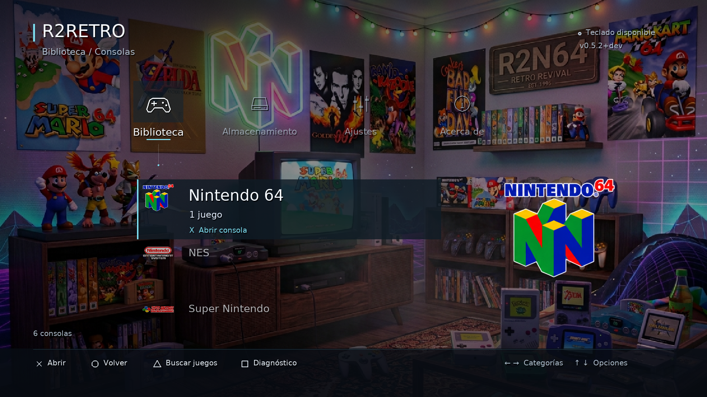
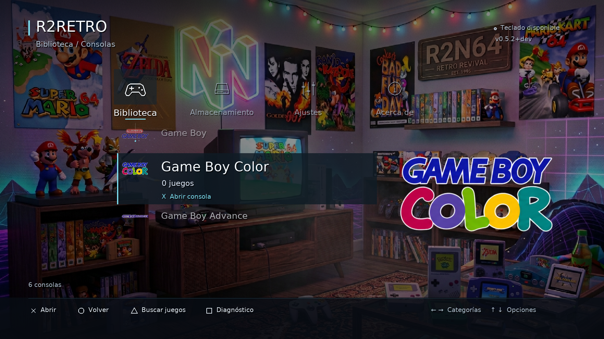

# Logos de consolas — 7 de octubre de 2026

## Reporte físico posterior: cuadros blancos (corrección candidata, sin compilar)

El usuario informa que los logos no se ven y aparecen cuadros blancos. No se
confirmó qué versión instalada presenta el fallo ni se obtuvo un log de esa
consola. La causa física sigue sin reproducirse; no atribuirla con certeza al
PNG, a la transparencia o a las dimensiones de la textura.

Se modificó únicamente el código de carga/presentación:

- El PNG original se decodifica una vez antes de GoldHEN. Se conservan sus
  coordenadas, colores y alfa; el archivo y su SHA-256 permanecen intactos.
- Se sustituye la textura única 1678×937 por seis texturas cacheadas, una por
  consola, con relleno transparente hasta potencias de dos (máximo1024×512).
  Se copia sin mezcla alfa previa, para no oscurecer bordes semitransparentes.
- Formato ARGB8888 explícito, `SDL_CreateTexture` y `SDL_UpdateTexture` con
  comprobación del resultado; mezcla alfa y modulación de color controladas.
- Errores de carga/subida/estado/dibujo se registran con nombre de consola y
  etapa. Un fallo notificado por SDL activa el icono vectorial de la fila.
  Que SDL acepte la subida no demuestra que los píxeles sean visibles en PS4.
- Sin lecturas, decodificación ni creación de texturas por cuadro. Las texturas
  se liberan antes del renderer, también si falla su dibujo.

Solo se realizó revisión de código, referencias y `git diff --check`.
En una segunda revisión se abrió visualmente el PNG original y se inspeccionó
su RGBA en memoria con System.Drawing, sin modificar ni guardar imágenes.
Los seis recortes están dentro de1678×937 y contienen color y transparencia;
ninguno es un rectángulo blanco en el archivo. Muestreo cada4píxeles:

| Logo | Muestras transparentes | Muestras con color |
| --- | ---: | ---: |
| N64 | 2866 | 3528 |
| GB | 2397 | 3162 |
| GBC | 1810 | 3507 |
| GBA | 773 | 1324 |
| SNES | 1284 | 2778 |
| NES | 2209 | 1573 |

Esto comprueba el recurso y sus coordenadas; no comprueba la subida/renderizado
del driver PS4. No se ejecutaron los binarios antiguos para presentar su
resultado como validación del código nuevo.
**No se compiló nada, no se ejecutó la versión modificada y no se creó PKG**,
por instrucción explícita del usuario. Pendientes compilación autorizada,
pruebas XMB de los seis sistemas/transparencia y validación física. La validación
histórica inferior corresponde a la implementación anterior, no a estos cambios.

## Implementación anterior y origen del arte

El JPG del usuario `Gemini_Generated_Image_csi7lzcsi7lzcsi7.jpg` contiene un
damero gris real, no transparencia. Se usó imagegen integrado para preparar una
versión derivada con alfa, conservando los seis nombres y colores característicos.
No es una extracción idéntica píxel a píxel: incorpora borde claro y las palabras
ENTERTAINMENT SYSTEM de NES en blanco para lectura sobre fondos oscuros.
El archivo de Downloads permanece intacto.

`assets/console-logos.png` es un atlas RGBA de 1678×937: arriba N64/GB/GBC;
abajo GBA/SNES/NES. SDL selecciona cada región explícitamente por SystemType y
la ajusta sin deformar. No se crean seis copias de la textura.

La textura se carga una vez junto con los recursos de inicio, antes de GoldHEN.
No se decodifica ni se lee por cuadro; permanece disponible tras cambios de ruta
del sandbox. Un archivo ausente/incompatible o fallo de textura mantiene los iconos
vectoriales y no impide arrancar. Se libera antes de destruir el renderer.

Se muestra en cada fila de consola, ampliado en la selección de la raíz y en la
cabecera al entrar en la consola. Nombres, navegación, carátulas y overlays de juego
conservan su funcionamiento. No representa núcleos ni sistemas adicionales.
Los scripts de build y empaquetado incremental copian y verifican el atlas.

## Validación

Las seis vistas se renderizaron y revisaron en SDL/GLES2: logo correcto por consola,
sin damero visible, proporciones conservadas y texto legible sobre la habitación.
3/3 pruebas de XMB software/GLES2 y arranque desktop aprobadas, incluyendo carga de
los seis logos y rechazo de SystemType desconocido. Ejecutable PS4 compilado.
No se generó un PKG ni se probó el cambio en consola física.
Logs `build/console-logos-tests.log` y `build/console-logos-ps4-build.log`.
Atlas SHA256 `8df15ecc308cc17a7517e7bcd997b0dbe65fbec72230e123389d438f3e740258`.

## Prompt final de la herramienta integrada

Prepare six clean console logos as a transparent PNG atlas for a DARK menu, using the supplied reference. Layout exactly three columns and two rows: N64 / Game Boy / Game Boy Color on top, Game Boy Advance / Super Nintendo / Nintendo Entertainment System below. Preserve logo names, shapes, and distinctive colors. Remove the checkerboard and all background completely. Use a very thin clean white keyline on each logo for visibility over dark backgrounds. Specifically change the NES words ENTERTAINMENT SYSTEM from black to WHITE so both lines are readable on dark backgrounds. Solid crisp shapes and lettering, no glow, no clouds, no shadow, no speckled edges or stray marks, no decorative symbols. Generous empty transparent space separating all six logos, no cropping of any logo. Accurate spelling. True transparent alpha.
