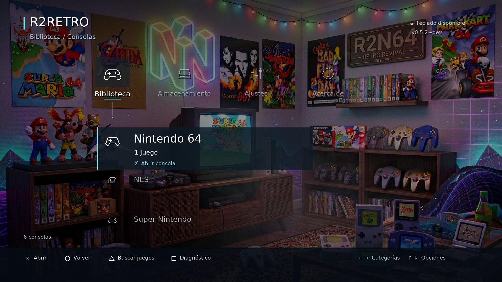
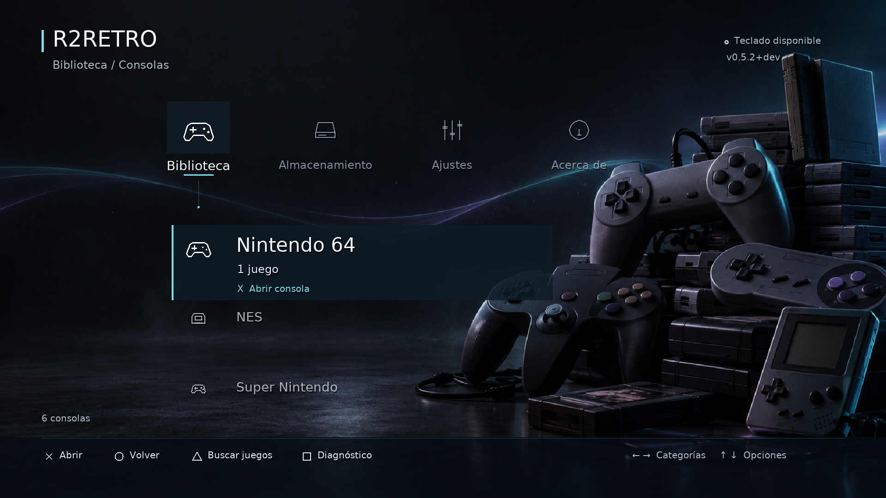

# Inicio R2RETRO — colección retro

## Fondo definitivo elegido por el usuario

`assets/background-room.jpg` sustituye la propuesta generada como fondo de inicio.
Es copia íntegra del adjunto `Gemini_Generated_Image_.jpg`, SHA256
`86729674cc574927fe7d431899b6eb2156b66e52da9030abedeee49eceb85e6d`.
Se mantiene la habitación Nintendo sin retocar sus elementos ni el rótulo R2N64.
El menú conserva la marca R2RETRO. El renderer recupera el contraste más marcado
para que los pósters no compitan con el texto. JPG original anterior como respaldo;
PNG generado conservado pero sin uso al iniciar. Preparado para empaquetado normal
e incremental; no se genera un nuevo PKG en este cambio.

3/3 comprobaciones XMB software/GLES2 y arranque desktop aprobadas; ejecutable
PS4 compilado. Vista revisada con un juego sintético, sin prueba física.
Logs: `build/room-background-tests.log`, `build/room-background-ps4-build.log`.

## Propuesta generada anterior (sustituida)

Fondo generado con la herramienta integrada imagegen el 6 de octubre de 2026.
Archivo de producción: `assets/background-home.png`. Original generado copiado
sin modificar; el renderer adapta la imagen a 1920×1080 y aplica contraste.
`assets/background.jpg` permanece intacto como respaldo si no carga el nuevo PNG.

La composición deja espacio oscuro a la izquierda y mandos/cartuchos a la derecha.
La navegación sigue siendo XMB: categorías horizontales y opciones verticales.
La selección tiene una superficie oscura y acento cian; portátiles y GBA reciben
iconos propios. Cabecera, paneles de detalles y controles mantienen márgenes para
TV. No se añaden shaders, lecturas de disco ni decodificación por cuadro: se usan
las texturas de fondo cacheadas existentes.

## Validación

7/7 pruebas de vídeo portátil software/GLES2, XMB software/GLES2, composición GPU
y arranque desktop aprobadas. Ejecutable PS4 compilado con la toolchain existente.
Capturas de inicio, ajustes y detalles generadas por el frontend SDL y revisadas
visualmente; la vista de consolas usa un juego sintético como ejemplo.
No se generó nuevo PKG ni se probó el resultado en PS4 física.
Logs: `build/home-visual-tests.log`, `build/home-visual-ps4-build.log`.

## Prompt utilizado

Use case: stylized-concept. Asset type: production background wallpaper for R2RETRO, a native PlayStation 4 retro console launcher with XMB navigation, 16:9 landscape 1920x1080. Create a refined cinematic retro gaming still life, dark graphite studio at night, with a sculptural stack of unbranded vintage 1990s home-console controllers, cartridges and one small handheld console only in the rightmost third and lower right. Restrained cyan edge lighting with very subtle violet reflections that complement the existing cyan-violet R2RETRO logo, charcoal brushed surfaces, tactile plastic, delicate film grain and realistic soft shadows. The left 65 percent and upper third must be almost empty deep charcoal with very gentle atmospheric lighting: that is the readable area for white interface text and horizontal category icons. Right side devices should be recognizable shapes but elegantly understated, not a cluttered gaming bedroom. One thin flowing light ribbon across the distant background, subtle and low contrast, reminiscent of classic console menu waves. Premium product photography rendered as polished 3D, asymmetrical composition, restrained highlights, no bright background behind the main left menu. No text, no letters, no numbers, no logos, no labels, no watermark, no UI elements. Opaque full bleed wallpaper, landscape widescreen.
