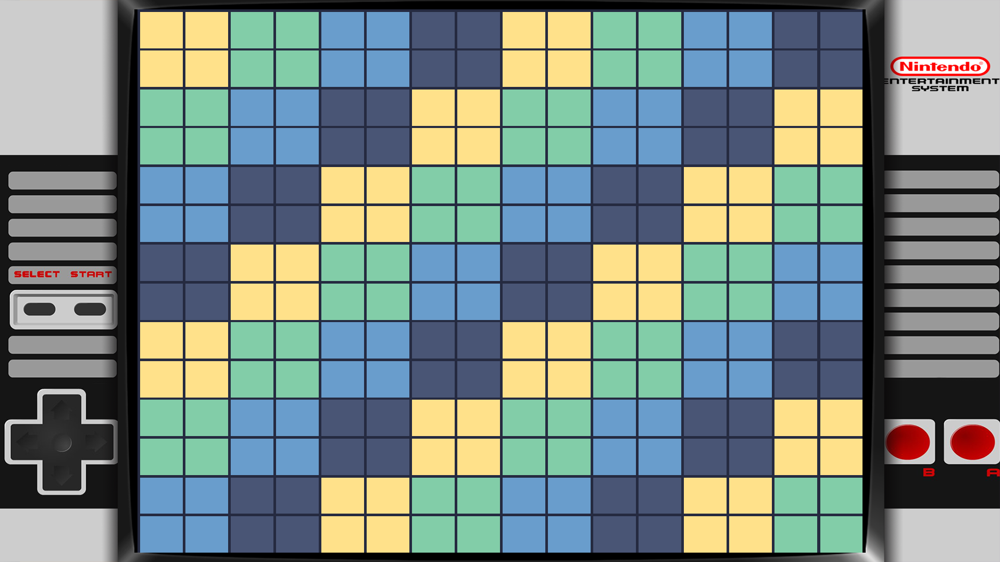

# R2RETRO v0.5.7 · Arreglo de NES y marco de consola

**Versión experimental para PS4 homebrew, creada por Rtwo / R2.** Incluye N64, NES, SNES, GB, GBC y GBA. No incluye ROMs comerciales ni BIOS externas.

## Novedades

- **NES ya no sale en negro en PS4.** La causa era el flag de compilación `-fdata-sections`, que dividía los datos en secciones con nombre no estándar (`.data.palette`, `.data.unvpalette`) que el cargador SELF de la PS4 no mapea, dejando la paleta a cero. El audio y la PPU sí funcionaban; por eso se oía sin verse. Se retiró el flag de los núcleos NES/SNES y portátiles (no se usaba `--gc-sections`). Verificado en consola por el usuario: la imagen ya se ve.
- **Marco de consola para NES.** Nueva superposición con la consola aportada, con el juego dentro del hueco de pantalla (apertura 258,18,1404,1044). Activo por defecto, como el de SNES, y conmutable en pausa (**L3+R3 → Marco**); respeta un `overlay:false` guardado.
- **Presentación:** la textura del juego pasa a ARGB8888 opaco, el formato canónico de 32 bits en GLES2, en lugar del XRGB de 24 bits empaquetado.
- Conserva Color GB, shaders LCD/CRT, marcos GB/GBC/GBA/SNES, guardados, capturas, biblioteca por consola y Cloudflare DoH para actualizaciones y Libretro.



## Instalación

[Descargar PKG](https://github.com/R2two/R2RETRO/releases/download/v0.5.7/R2RETRO-v0.5.7-nes-fix-overlay.pkg) · [SHA-256](https://github.com/R2two/R2RETRO/releases/download/v0.5.7/R2RETRO-v0.5.7-nes-fix-overlay.pkg.sha256)

**Instala manualmente sobre la versión anterior, sin desinstalar:** por USB o copiando el PKG por FTP a `/data/pkg/` y usando Package Installer de GoldHEN con origen HDD. Si tienes v0.5.6 y el instalador avisa de «misma versión», desinstala primero e instala este.

Se conservan Title ID `RNTD00064`, Content ID `IV0001-RNTD00064_00-R2N64APP00000001`, datos `/data/R2N64` y USB `R2N64/roms/{n64,nes,snes,gb,gbc,gba}`. No se migran ni renombran partidas/configuración.

## Paquete y verificación

- Archivo: `R2RETRO-v0.5.7-nes-fix-overlay.pkg`.
- Tamaño: **70.582.272 bytes** (67,31 MiB).
- APP_VER / SFO: **00.57**.
- SHA-256:

```text
7abd7c43e1187e1b5d1f1e1649c10c7fde201d8f1b940bf9be1b08526e10b104
```

Se adjuntan PKG, suma SHA-256 y `build-info-v0.5.7.json`. La etiqueta v0.5.7 conserva el código correspondiente, submódulos fijados y scripts/parches de integración.

## Pruebas y límites

- Compilaciones desktop y PS4 con la toolchain OpenOrbis/PacBrew existente; paquete extraído, identidad/SFO y recursos comparados (incluido `assets/overlays/nes.png`).
- **52/52 grupos CTest aprobados.** Incluyen el nuevo marco NES (apertura, mate, carga/decodificación, persistencia y fallback), los ajustes por sistema y las regresiones de NES/SNES/portátiles/N64.
- Vista previa del marco compuesto con el juego dentro de la apertura y 4/4 muestras verificadas en la composición.
- **Confirmación física del usuario:** con el arreglo de paleta y el marco NES, la imagen se ve y funciona perfectamente en su PS4. No es una certificación de velocidad, audio, guardados o compatibilidad completa de N64.

[Guía de uso](https://github.com/R2two/R2RETRO/blob/v0.5.7/docs/USER-GUIDE.md) · [Detalle técnico del arreglo y el marco](https://github.com/R2two/R2RETRO/blob/v0.5.7/docs/NES-PALETTE-AND-OVERLAY.md) · [Apoya el desarrollo en Ko-fi](https://ko-fi.com/rtwo_)
